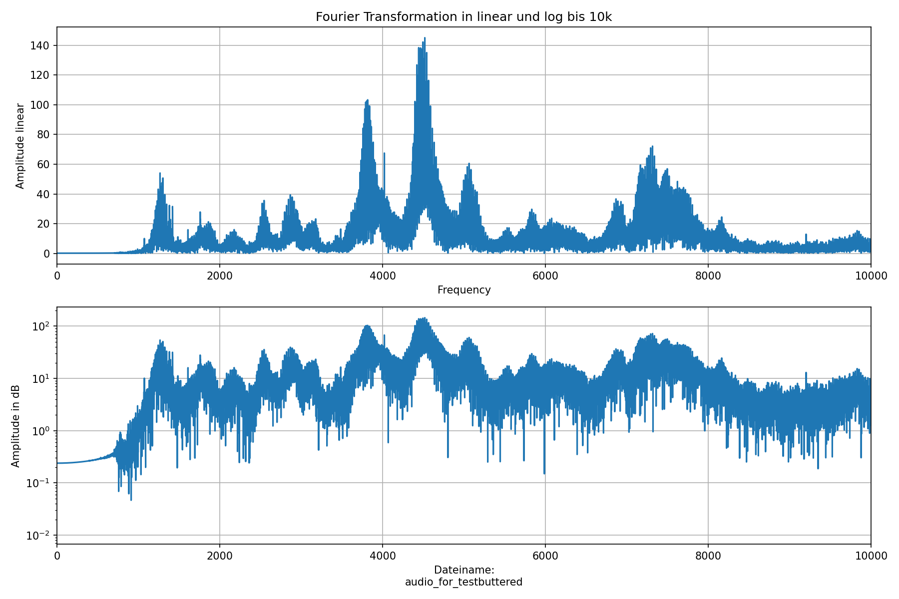

================
Projektbericht
================
-----------
Mirko Matosin und Alexander Wuenstel
-----------

.. _Bild:

.. 
::

Das Bild_ zeigt die Fourier-transformierte einer durch das Butterworth-Filter angepasste Sound-Datei. Diese Datei ist 11.5 Sekunden lang und beeinhaltet häufige Frequenzen um 2kHz und 7 kHz.
